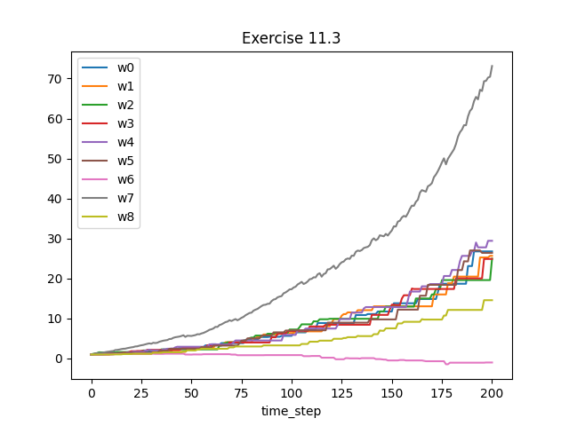

## Exercise 11.1
*Convert the equation of n-step off-policy TD (7.9) to semi-gradient form.
Give accompanying definitions of the return for both the episodic and continuing cases.*

$w_{t+n} = w_{t+n-1} + \alpha \rho_{t+1} ... \rho_{t+n-1} \delta_t \triangledown \hat{v}(S_t,w_{t+n-1})$

episodic case

$\delta_t = R_{t+1} + ... + \gamma^{n-1}R_{t+n} + \gamma^n \hat{v}(S_{t+n},w_{t+n-1}) - \hat{v}(S_t, w_{t+n-1})$

continuing case

$\delta_t = R_{t+1} - \bar{R}_t ... + R_{t+n} - \bar{R}_{t+n-1} + \hat{v}(S_{t+n},w_{t+n-1}) - \hat{v}(S_t, w_{t+n-1})$

## Exercise 11.2
*Convert the equations of n-step $Q(\sigma)$ (7.11 and 7.17) to semi-gradient
form. Give definitions that cover both the episodic and continuing cases.*

The update to weights is the same for semi-gradient $Q(\sigma)$ and semi-gradient sarsa

$w_{t+n} = w_t + \alpha[G_{t:t+n} - \hat{Q}_{t+n-1}(S_t,A_t,w_{t+n-1})] \triangledown \hat{Q}(S_t,A_t,w_{t+n-1})$

episodic case

$G_{t:t+n} = R_{t+1} + \gamma(\sigma_{t+1}\rho{t+1} + (1-\sigma_{t+1})\pi(A_{t+1}|S_{t+1}))(G_{t+1:t+n} - Q_{h-1}(S_{t+1},A_{t+1})) + \gamma \bar{V}_{t+n-1}(S_{t+1})$

continuing case

$G_{t:t+n} = R_{t+1} - \bar{R}_t + (\sigma_{t+1}\rho{t+1} + (1-\sigma_{t+1})\pi(A_{t+1}|S_{t+1}))(G_{t+1:t+n} - Q_{h-1}(S_{t+1},A_{t+1})) + \bar{V}_{t+n-1}(S_{t+1})$

## Exercise 11.3
*(programming) Apply one-step semi-gradient Q-learning to Baird’s counterexample and show empirically that its weights diverge*

Here is our example with off policy semi-gradient q-learning. After just 20 steps the weights diverge to negative infinity, delta becomes too large for python to handle and becomes nans. Note the scale on the top left of the figure.

Code is in baird.py

## Exercise 11.4
*Prove (11.24). Hint: Write the RE as an expectation over possible statess of the expectation of the squared error given that St = s. Then add and subtract the true value of state s from the error (before squaring), grouping the subtracted true value with the return and the added true value with the estimated value. Then, if you expand the square, the most complex term will end up being zero, leaving you with (11.24).*

