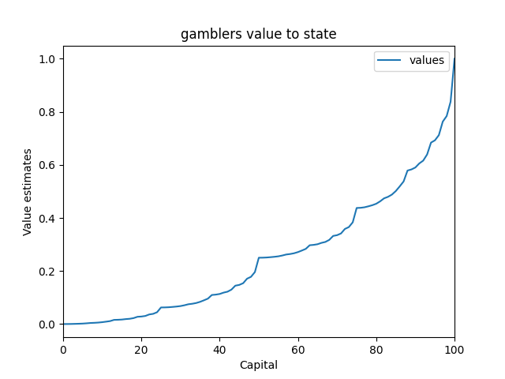
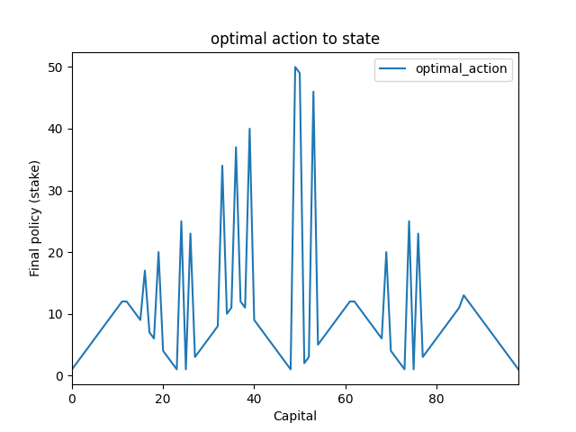
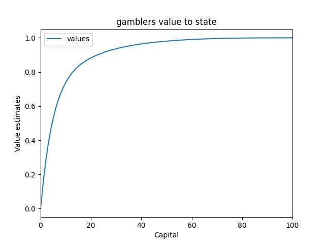
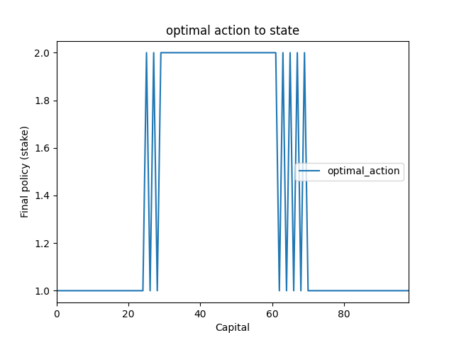

## Exercise 4.1
*If π is the equiprobable random policy, what is qπ(11, down)?
What is qπ(7, down)?*

$qπ(11, down) = \sum_{s'}p(s',r|s=11,a=down) * [r_{11,s'} + vπ(s')]$

$qπ(11, down) = 1 * [0 + 0]$

$qπ(11, down) = 0$

and...

$qπ(7, down) = 1 * [-1 + -14]$

$qπ(7, down) = -15$

## Exercise 4.2

*Suppose a new state 15 is added to the gridworld just below
state 13, and its actions, left, up, right, and down, take the agent to states
12, 13, 14, and 15, respectively. Assume that the transitions from the original
states are unchanged. What, then, is vπ(15) for the equiprobable random
policy? Now suppose the dynamics of state 13 are also changed, such that
action down from state 13 takes the agent to the new state 15. What is vπ(15)
for the equiprobable random policy in this case?*

In case 1, I calculated the answer with a value iteration. vπ(15) = -19.999

In case 2, using the same method but with modified actions, vπ(15) = -19.999

## Exercise 4.3

*What are the equations analogous to (4.3), (4.4), and (4.5) for
the action-value function qπ and its successive approximation by a sequence of
functions q0, q1, q2, . . . ?*

$qπ(s,a) = Eπ[R_{t+1} + \sum_{a'\in A(S_{t+1})}π(a'|S_{t+1})*γ*qπ(s',a')|S_{t}=s,A_{t}=a]$

$qπ(s,a) = \sum_{s',r}p(s',r|s,a) * [r + γ\sum_{a'\in A(s')}π(a'|s')*qπ(s',a')$

$q_{k+1}(s,a) = \sum_{s',r}p(s',r|s,a) * [r + γ\sum_{a'\in A(s')}π(a'|s')*q_{k}(s',a')$

## Exercise 4.4

*In some undiscounted episodic tasks there may be policies
for which eventual termination is not guaranteed. For example, in the grid
problem above it is possible to go back and forth between two states forever.
In a task that is otherwise perfectly sensible, vπ(s) may be negative infinity
for some policies and states, in which case the algorithm for iterative policy
evaluation given in Figure 4.1 will not terminate. As a purely practical matter,
how might we amend this algorithm to assure termination even in this case?
Assume that eventual termination is guaranteed under the optimal policy.*

If there is a cycle of states that causes the value to increase or decrease an infinite amount then once the state is reached that causes this value to either go towards negative or positive infinity then the value function should start to increase/decrease by a constant amount. We can add a flag to check if the value is increasing/decreasing at a constant rate for a number of iterations to automatically stop.

If this is being used in tandem with iterative policy improvement, we can simply specify a maximum number of iterations for the policy evaluation because we know that we will eventually get closer and closer to the gauranteed eventual termination while we change to improved policies.

## Exercise 4.5 (programming)

*Write a program for policy iteration and
re-solve Jack’s car rental problem with the following changes. One of Jack’s
employees at the first location rides a bus home each night and lives near
the second location. She is happy to shuttle one car to the second location
for free. Each additional car still costs $2, as do all cars moved in the other
direction. In addition, Jack has limited parking space at each location. If
more than 10 cars are kept overnight at a location (after any moving of cars),
then an additional cost of $4 must be incurred to use a second parking lot
(independent of how many cars are kept there). These sorts of nonlinearities
and arbitrary dynamics often occur in real problems and cannot easily be
handled by optimization methods other than dynamic programming. To check
your program, first replicate the results given for the original problem. If your
computer is too slow for the full problem, cut all the numbers of cars in half.*

## Exercise 4.6

*How would policy iteration be defined for action values? Give
a complete algorithm for computing q∗, analogous to Figure 4.3 for computing
v∗. Please pay special attention to this exercise, because the ideas involved
will be used throughout the rest of the book.*

```
1. Initialization
Q(s,a) in R and π(a|s) in A(s) arbitrarily for all s in S$

2. Policy Evaluation
Repeat
    delta <- 0
    for each s in S:
        for each a in A(s):
            q <- q(a,s)
            q(a,s) <- sum over (s') in S(s|a) { p(s',r|s,a) * [r + π(a|s')*γ*q(a',s')]}
            delta <- max(delta, |q - q(a,s)|)
    until delta < epsilon (small positive #)

3. Policy Improvement
    policy-stable <- true
    for each s in S
        a <- π(a|s')
        π(a|s') = argmax_a over q(s,a) (assign non negative values to optimal value sonly)
        if a != π(a|s') then policy-stable <- false
    if policy-stable, then stop and return Q and π; else go to 2
```


## Exercise 4.7

*Suppose you are restricted to considering only policies that are
e-soft, meaning that the probability of selecting each action in each state, s,
is at least e/|A(s)|. Describe qualitatively the changes that would be required
in each of the steps 3, 2, and 1, in that order, of the policy iteration algorithm
for v∗ (Figure 4.3).*

Durng the policy improvement step, for the actions that would be made to have selection zero, instead we make them e/|A(s)|

```
3. Policy Improvement
    policy-stable <- true
    for each s in S:
        a <- π(s)
        non_optimal_count <- # not in argmax calculation
        assign non optimal π(a|s) -> epsilon/|A(s)|
        distribute 1 - non_optimal_count*epsilon/|A(s)| probabilities for π(s) among optimal actions
        if a != π(s) then policy-stable <- false
        ...
```

## Exercise 4.8

*Why does the optimal policy for the gambler’s problem have
such a curious form? In particular, for capital of 50 it bets it all on one flip,
but for capital of 51 it does not. Why is this a good policy?*

This is a good policy because it balances between two extremes: making consersative, less risky bets that have low potential reward, and making instantaneously risky all-in bets with high potential reward. The risk vs potential reward of these two strategies depends on how many coins the agent currently has, especially because the agent has a goal of making 100 coins.

At 50 coins, the potential value of instanteously winning at 40% outweights any conservative bets that may take it to a slightly higher value state and risky lower value state as well.

The value estimate is proportional to the probability of instantly winning at 50. This means that the q(50|50) is greater than any other q values at s=50. q(50|50) = 0.4 * r_w + 0.6 * r_l = 0.4 * 1 + 0.6 * 0 = 0.4.

At 50 there is a certain threshold of risk vs. reward that is crossed. Before 50 it is not worth it to bet all in because the reward is not 100. It is better to bet conservatively and make your way up to 50. After 50, it is better not to go all in because you can bet 1 and if you win, continue to play conservatively, if you lose, you return to the 50 state and can go all in.

There is a path starting at 25 to go all in twice in a row and win as well that outweighs the rest of the potential actions. This mathematical balance between risk & potential gain is reflected with the peculiar shape and forms this optimal policy that balances between the two.

## Exercise 4.9 (programming)

*Implement value iteration for the gambler’s
problem and solve it for ph = 0.25 and ph = 0.55. In programming, you may
find it convenient to introduce two dummy states corresponding to termination
with capital of 0 and 100, giving them values of 0 and 1 respectively. Show
your results graphically, as in Figure 4.6. Are your results stable as θ → 0?*

For ph = 0.25:





For ph = 0.55:





My results are mostly stable as 0 -> 0. I've ran the results with ph = 0.4 and they don't exactly match the figures in the textbook. I am worried about this.

It's very interesting to see how huge a difference there is between 0.25 and 0.55. Once the probabilities are in favor of the agent, the optimal policy becomes extremely conservative. When you have the upper hand, there is not much of a point in taking risks.

I also took the liberty of trying 0.49 and .51 and the difference is just as stark.

## Exercise 4.10

*What is the analog of the value iteration backup (4.10) for
action values, qk+1(s, a)?*


$q_{k+1}(s,a) = \sum_{s',r}p(s',r|s,a) * [r + γ\max_{a'}q_{k}(s',a')$