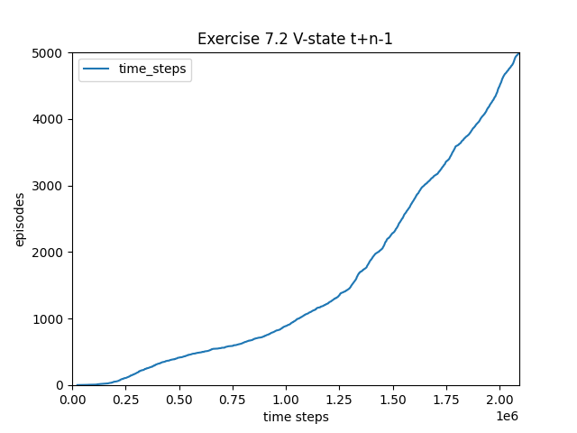

## Exercise 7.1
*In Chapter 6 we noted that the Monte Carlo error can be written as the
sum of TD errors (6.6) if the value estimates don’t change from step to step. Show that
the n-step error used in (7.2) can also be written as a sum TD errors (again if the value
estimates don’t change) generalizing the earlier result.*

The error factor for n-step return is:

$G_{t:t+n} - V_{t+n-1}(S_t)$

With the assumption that values don't change:

$G_{t:t+n} - V_(S_t)$

And the error factor for TD errors are:

$\delta_t = R_{t+1} + \gamma V(S_{t+1}) - V(S_{t})$

N-step return written as a sum of TD ErroerS:

$G_{t:t+n} - V(S_t) = R_{t+1} + \gamma R_{t+2} + ... + \gamma^{n-1}R_{t+n} + \gamma^{n}V(S_{t+n}) - V(S_t)$

Then using:

$R_{t+1} = R_{t+1} + \gamma V(S_{t+1}) - V(S_{t}) - \gamma V(S_{t+1}) + V(S_{t})$

$= R_{t+1} + \gamma V(S_{t+1}) - V(S_{t}) - \gamma V(S_{t+1}) + V(S_{t}) + \gamma R_{t+2} + ... + \gamma^{n-1}R_{t+n} + \gamma^{n}V(S_{t+n}) - V(S_t)$

$= \delta_t - \gamma V(S_{t+1}) + V(S_{t}) + \gamma R_{t+2} + ... + \gamma^{n-1}R_{t+n} + \gamma^{n}V(S_{t+n}) - V(S_t)$

$= \delta_t - \gamma V(S_{t+1}) + V(S_{t}) + \gamma[\delta_{t+1} - \gamma V(S_{t+2}) + V(S_{t+1})] + ... + \gamma^{n}[\delta_{t+n-1} - \gamma V(S_{t+n}) + V(S_{t+n-1})] +  \gamma^{n}V(S_{t+n}) - V(S_t)$

$= \sum_{k=t}^{t+n-1}{\gamma^{k-t}\delta_{k}} -\sum_{k=t}^{t+n-1}{\gamma^{k-t+1}V(S_{k+1})} + \sum_{k=t}^{t+n-1}{\gamma^{k-t}V(S_k)} + \gamma^{n}V(S_{t+n}) - V(S_t)$

$= \sum_{k=t}^{t+n-1}{\gamma^{k-t}\delta_{k}} - \sum_{k=t}^{t+n-2}{\gamma^{k-t+1}V(S_{k+1})} + \sum_{k=t+1}^{t+n-1}{\gamma^{k-t}V(S_k)}$

$= \sum_{k=t}^{t+n-1}{\gamma^{k-t}\delta_{k}} - \sum_{k=t+1}^{t+n-1}{\gamma^{k-t}V(S_{k})} + \sum_{k=t+1}^{t+n-1}{\gamma^{k-t}V(S_k)}$

$= \sum_{k=t}^{t+n-1}{\gamma^{k-t}\delta_{k}}$

## Exercise 7.2
*With an n-step method, the value estimates do change from
step to step, so an algorithm that used the sum of TD errors (see previous exercise) in
place of the error in (7.2) would actually be a slightly di↵erent algorithm. Would it be a
better algorithm or a worse one? Devise and program a small experiment to answer this
question empirically.*

For the experiment I decided to apply the n-step method to the racetrack problem with n=2.

Keeping the values on the time step of the state being updated performs better!

## Exercise 7.3
*Why do you think a larger random walk task (19 states instead of 5) was
used in the examples of this chapter? Would a smaller walk have shifted the advantage
to a di↵erent value of n? How about the change in left-side outcome from 0 to 1 made
in the larger walk? Do you think that made any di↵erence in the best value of n?*

A smaller walk would have 