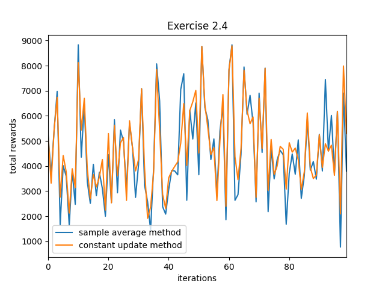
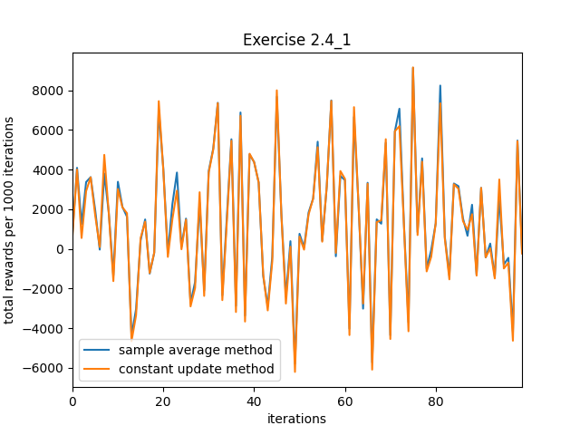

# Chapter 2

## Exercise 2.1
*In the comparison shown in Figure 2.1, which method will
perform best in the long run in terms of cumulative reward and cumulative
probability of selecting the best action? How much better will it be? Express
your answer quantitatively.*


## Exercise 2.2
*Give pseudocode for a complete algorithm for the n-armed
bandit problem. Use greedy action selection and incremental computation of
action values with α = 1/k step-size parameter. Assume a function bandit(a) that takes an action and returns a reward. Use arrays and variables; do not subscript anything by the time index t (for examples of this style of pseudocode, see Figures 4.1 and 4.3). Indicate how the action values are initialized
and updated after each reward. Indicate how the step-size parameters are set
for each action as a function of how many times it has been tried.*


```
Initialize policy map [] of length n to val_init (default 0)
Set alpha = 1.0
Set k map = [1.0 array of length n]
Set exploration = some constant between 0 and 1
Repeat while playing:
    random = random value between 0 and 1 sampled from a uniform distribution
    If random <= explore:
        arm = random integer between 0 and n
    else:
        arm = index of max value from policy map
    reward = bandit(arm)
    Set k maps[arm] += 1.0
    policy_map[arm] += (1.0/k maps[arm]) * (reward - policy_map[arm])
```

## Exercise 2.3
*If the step-size parameters, αk, are not constant, then the estimate Qk is a weighted average of previously received rewards with a weighting
different from that given by (2.6). What is the weighting on each prior reward
for the general case, analogous to (2.6), in terms of αk?*
  
Q<sub>k+1</sub> = Q<sub>k</sub> + &alpha;<sub>k</sub> * [R<sub>k</sub> - Q<sub>k</sub>]  

= &alpha;<sub>k</sub>R<sub>k</sub> + (1 - &alpha;<sub>k</sub>) * Q<sub>k</sub>  

= &alpha;<sub>k</sub>R<sub>k</sub> + (1 - &alpha;<sub>k</sub>) * [&alpha;<sub>k-1</sub>R<sub>k-1</sub> + (1 - &alpha;<sub>k-1</sub>) * Q<sub>k-1</sub>]  
= &alpha;<sub>k</sub>R<sub>k</sub> + (1 - &alpha;<sub>k</sub>)&alpha;<sub>k-1</sub>R<sub>k-1</sub> + (1 - &alpha;<sub>k</sub>)(1 - &alpha;<sub>k-1</sub>) * Q<sub>k-1</sub>  

= &alpha;<sub>k</sub>R<sub>k</sub> + (1 - &alpha;<sub>k</sub>)&alpha;<sub>k-1</sub>R<sub>k-1</sub> + (1 - &alpha;<sub>k</sub>)(1 - &alpha;<sub>k-1</sub>) * [&alpha;<sub>k-2</sub>R<sub>k-2</sub> + (1 - &alpha;<sub>k-2</sub>) * Q<sub>k-2</sub>]  
= &alpha;<sub>k</sub>R<sub>k</sub> + (1 - &alpha;<sub>k</sub>)&alpha;<sub>k-1</sub>R<sub>k-1</sub> + (1 - &alpha;<sub>k</sub>)(1 - &alpha;<sub>k-1</sub>)&alpha;<sub>k-1</sub>R<sub>k-2</sub> + (1 - &alpha;<sub>k</sub>)(1 - &alpha;<sub>k-2</sub>)(1 - &alpha;<sub>k-2</sub>) * Q<sub>k-2</sub>

= $\alpha_{k}R_{k} + \sum_{i=1}^{k} [\alpha_{k-i}R_{k-i}\prod_{j=0}^{k-2}(1 - \alpha_{k-j})] + Q_{0}\prod_{j=0}^{k-1}(1 - \alpha_{k-j})$

 ...


## Exercise 2.4
*Design and conduct an experiment to demonstrate the difficulties that sample-average methods have for nonstationary
problems. Use a modified version of the 10-armed testbed in which all the
q(a) start out equal and then take independent random walks. Prepare plots
like Figure 2.1 for an action-value method using sample averages, incrementally computed by α = 1/k, and another action-value method using a constant
step-size parameter, α = 0.1. Use ε = 0.1 and, if necessary, runs longer than
1000 plays.*



These are the cumulative rewards of running the described experiment 100 times with 1000 iterations each.

```sample wins: 36 const wins: 60 ties: 4```

The reason we ran so many iterations of the experiment was because when we ran them independently, the results were inconsistent. However over a large number of trials the sample methods did worse than the constant method.

During the creation of this experiment it was discovered that the sample method actually does better than the constant method when every arm takes a random walk in the same direction. In other words, when the entire n-armed bandits takes a random walk. Here the bandit would move all distributions in the same direction with the same unit.



```sample wins: 75 const wins: 25 ties: 0```

The sample method will perform better than a constant method on a non stationary problem where the entire environment changes in the same direction.

This is because if all the arms are moving in the same direction, then whatever is optimal will remain optimal. This problem is really only technically stationary. Perhaps stationary should be defined in such a way that the optimal actions must change.

We were curious what would happen if we made a bandit which had a random walk with dependent parts that did not all move in the same direction, but had some sort of alternating rule where if one went up, the other went down. So we did one with an alternating random walk where each arm would do the opposite direction of the previous.


```sample wins: 31 const wins: 63 ties: 6```

The result was consistent with the first experiment. Thus, we can see that the constant update method performs better for a nonstationary problem where the optimal arm is subject to change.

With a constant method new rewards are weighed in with equal magnitude to the policy. In sampling methods, the weight of new rewards are diminished as time increases because k grows larger with each time step. When the optimal arm changes it's difficult for the sampling method to take enough steps to make enough change to its policy to reflect this. As time goes on, the sampling method actually get worse at this. This is because it's slowing down the rate of change to its policies while the optimal arm's rate of change is random.


## Exercise 2.5
*The results shown in Figure 2.2 should be quite reliable because they are averages over 2000 individual, randomly chosen 10-armed bandit tasks. Why, then, are there oscillations and spikes in the early part of
the curve for the optimistic method? What might make this method perform
particularly better or worse, on average, on particular early plays?*

Because the optimistic initial values are so much larger than the possible values, and because the alpha value is only 0.1, it would take a large number of steps to bring the policy estimates down to reality. During this time, the agent would theoretically bring down the policy values of the less optimal arms with a larger difference than the optimal arm. However it would still end up performing a round-robin like policy. Say the optimal value always returns 1 and the rest return -1. Even if the optimal value is tried first, the rest of the values will still have optimistic policy values of 5 compared to the rest s o it'll try those out as well. After one round robin, the optimal value's policy guess would be `5 - 0.1 * 4 = 4.6` while the non optimal would be `5 - 0.1 * 5 = 4.4`. It would exploit the optimal value but then find that its policy estimate has become lower than the non optimals, and then try those. This process would repeat so the actual rewards resulted would be extremely sporadic until the estimates become closer to the real values.

This is an extreme case to illustrate the oscillations.

The spikes can occur because of the same reasons as demonstrated here when the policy values get closer to the real. It would take more steps exploiting the optimal action before its policy value becomes less than the other actions because the difference is smaller, thus the update would be smaller.

When the distribution of agents are more evened out, then the agent would play better on early plays. Especially if there are a few close to optimal agents. The agent could end up alternating between six optimal and near optimal arms, and then reducing the policy for four other less optimals. Overall, the more near optimal arms there are, the better this agent would perform at the beginning. If there's only one optimal arm, this agent would perform worse.


## Exercise 2.6
*Suppose you face a binary bandit task whose true action values change randomly from play to play. Specifically, suppose that for any play the true values of actions 1 and 2 are respectively 0.1 and 0.2 with probability 0.5
(case A), and 0.9 and 0.8 with probability 0.5 (case B). If you are not able to
tell which case you face at any play, what is the best expectation of success
you can achieve and how should you behave to achieve it? Now suppose that
on each play you are told if you are facing case A or case B (although you still
don’t know the true action values). This is an associative search task. What
is the best expectation of success you can achieve in this task, and how should
you behave to achieve it?*

The best expectation of success would be to get a cumulative value of 0.5*t where t is the number of steps.

This is because `0.5*(0.1) + 0.5*(0.9) = 0.5` and `0.5*(0.2) + 0.5*(0.8) = 0.5`. The expected values of playing either move is 0.5. Thus, no matter what combination of moves you play overall, the expected value is 0.5.

Assuming that you run the task until you get an estimate for each action per task, then the best case you can achieve would be:
`0.5 * (0.9 + 0.2) = 0.55`. So the best case expected value is 0.55*t.

To get this you should have two policy maps for each case you are facing and perform a standard, mostly greedy agent on both tasks. It would make sense to set initial values to 0.5, and to diminish the exploration factor to 0 over time because this is a stationary task.
