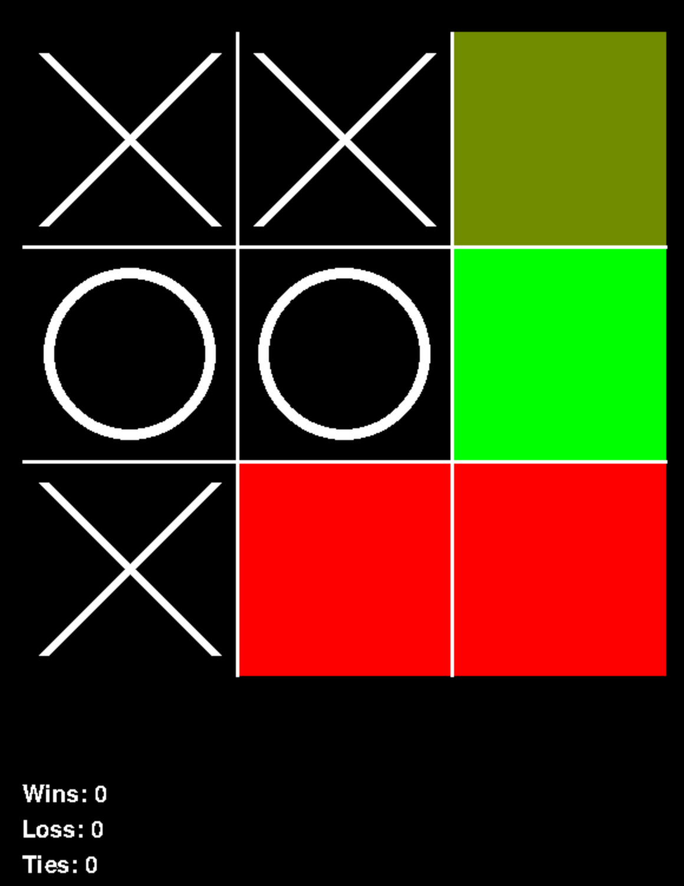

# Tic Tac Toe

## Update rule for a temporal difference model

`V(s) = V(s) + a * (V(s') - V(s))`

Where `V(s)` = estimated value of state

`s` = state

`s'` = next state

`a` = step size parameter AKA rate of learning

The step size parameter is generally reduced over time.

This is considered a temporal difference model update rule because its updates are based on the estimates of a state from two different times.

## Extended Tic Tac Toe Temporal Difference Example

This project contains a tic tac toe game model, a viewer, and a learning agent to train/test on the tic tac toe game model. It has an 'expert' implementation taken from [billtub's gamelearner](https://github.com/billtubbs/game-learner) and a random agent as well. The agent's policies are learned via a temporal difference model, as described above.

At each move, an agent will decide its move by comparing each possible move and resulting game state's values in its learned policy map. A "greedy" agent will always choose to play the most optimal state value. When an agent wins or loses a game, it learns that either the policy values of the game states that lead up to the loss or win should be lowered or raised.

The agent has symmetric awareness as an option.

We have also implemented experiments that train multiple agents in parallel, and then takes the mean of their policies to create a "meta agent"'s policies, inspired by Adaboost. The combined policy map has consistently performed better than the individual ones.

If you would like to vs. our meta agent then you may play it by running `python game.py` on python 3.5.2. Please remember to `pip install requirements.txt` before running the game.

The game will show you what the agent is "thinking" by coloring available blocks according to its policy map values before it makes its move. Red being the lowest value, green the greatest.

